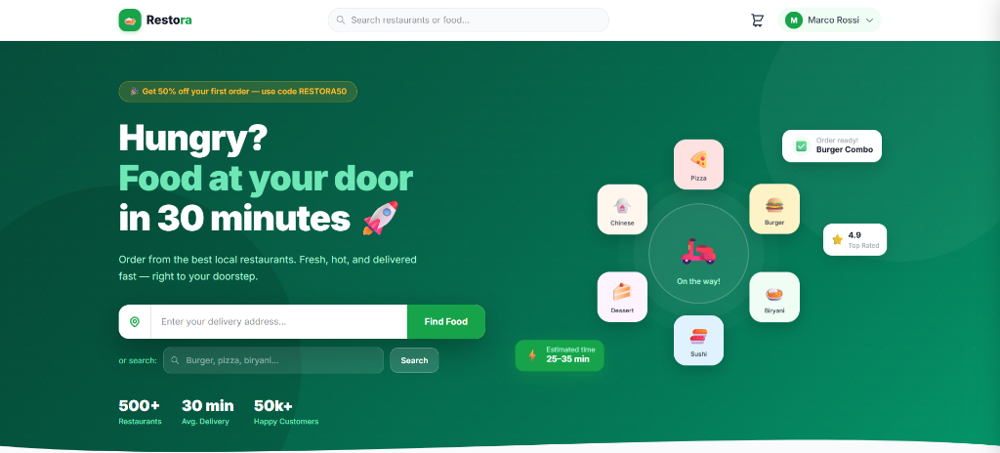
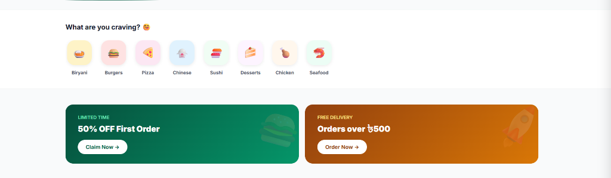
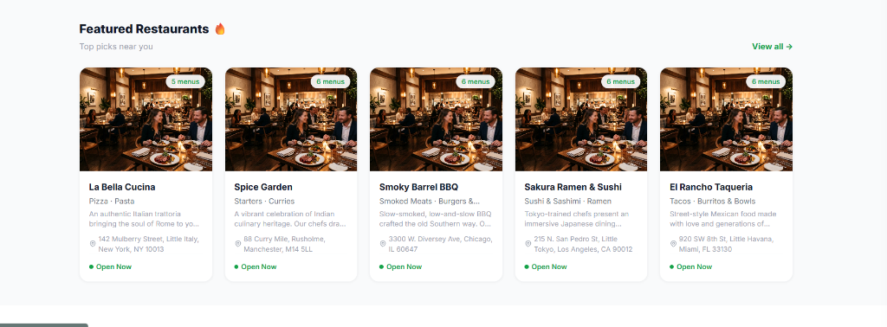
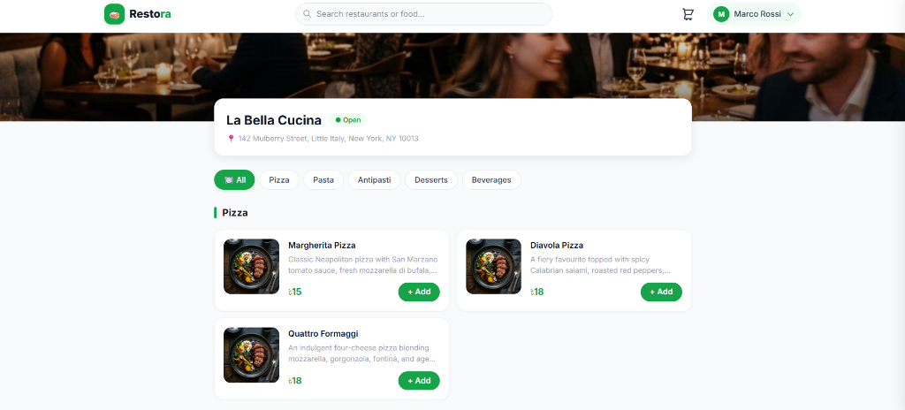

# Restora Frontend 🍕

This is the customer-facing frontend and admin dashboard application for **Restora**, built with React and Vite. It provides a beautiful, modern, and highly responsive user experience for customers ordering food, as well as powerful administration panels for restaurant owners and super admins.

## Features ✨

### Customer Experience
- **Vibrant Landing Page:** A welcoming hero section, dynamic food categories, and promotional banners to drive conversions.
- **Restaurant Discovery:** Browse through all partner restaurants, view their ratings, and see their menus.
- **Menu & Cart:** Interactive menus with high-quality images, easy add-to-cart functionality, and a persistent shopping cart.
- **Checkout & Real-time Status:** Smooth checkout flow with order tracking.

### Partner & Admin Portals
- *Note: For details on the Admin and Owner portals, check out the Backend README.*
- Secure, role-based routing protecting the `/admin` and `/owner` routes.

## Screenshots 📸

### Landing Page (Hero Section)


### Landing Page (Categories & Offers)


### Discover Restaurants


### Restaurant Menu & Details


## Tech Stack 🛠️

- **Framework:** React 18
- **Build Tool:** Vite
- **Routing:** React Router v6
- **Styling:** Custom CSS & UI Tokens (No bulky CSS frameworks used for core components to maintain pixel-perfect control).
- **Icons:** Inline SVGs / Emojis for zero-dependency lightweight graphics.
- **API Communication:** Fetch API standard, interacting with Laravel Sanctum for secure token-based auth.

## Getting Started 🚀

1. **Prerequisites:** Ensure you have Node.js 18+ installed.
2. **Install Dependencies:**
   ```bash
   npm install
   ```
3. **Environment Setup:** Make sure the backend API is running at `http://localhost:8000`. If you need to change this, update the `BASE_URL` in `src/api/index.js`.
4. **Run Development Server:**
   ```bash
   npm run dev
   ```
5. **View the App:** Open your browser and navigate to `http://localhost:5173` (or the port Vite provides).

## Project Structure 📁

- `src/pages/` - Contains all route-level components (Landing, Admin, Owner, etc.)
- `src/components/` - Reusable UI components (Navbar, Footer, Cart, etc.)
- `src/context/` - React Context providers for global state (AuthContext, CartContext)
- `src/api/` - Centralized API fetch logic and endpoints
- `docs/screenshots/` - Project screenshots for documentation

---
*Built with ❤️ for modern restaurant management.*
